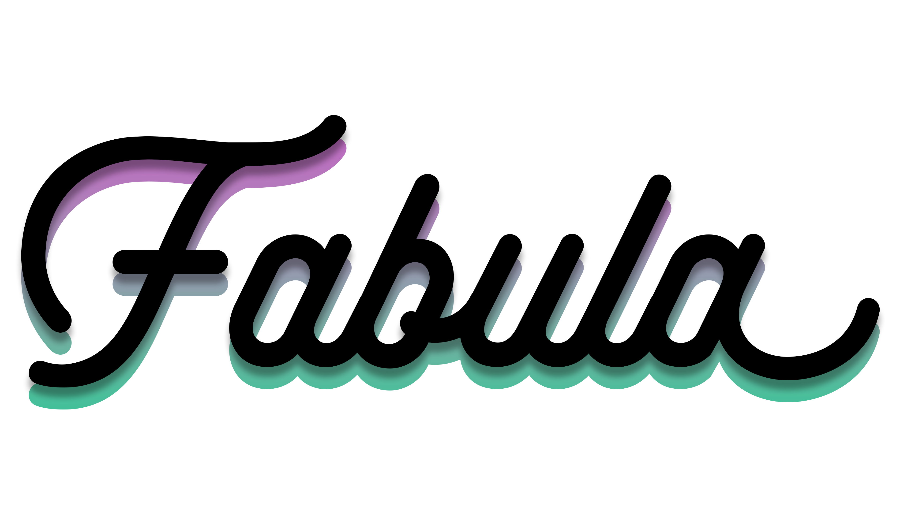

<!-- PROJECT SHIELDS -->
<!--
*** I'm using markdown "reference style" links for readability.
*** Reference links are enclosed in brackets [ ] instead of parentheses ( ).
*** See the bottom of this document for the declaration of the reference variables
*** for contributors-url, forks-url, etc. This is an optional, concise syntax you may use.
*** https://www.markdownguide.org/basic-syntax/#reference-style-links
-->

<!-- PROJECT LOGO -->
 

  

<h1 align="center">Fabula</h1>

  

    Welcome to Fabula, a web application built for the purposes of sharing, and interacting with user-written literary pieces.
     
    <a href="https://github.com/DimitarM45/Fabula"><strong>Explore the docs »</strong></a>
  

[![Contributors][contributors-shield]][contributors-url]
[![Forks][forks-shield]][forks-url]
[![Stargazers][stars-shield]][stars-url]
[![Issues][issues-shield]][issues-url]
[![License][license-shield]][license-url]

<!-- TABLE OF CONTENTS -->

  
Table of Contents

  <ol>
    <li>
      <a href="#about-the-project">About The Project</a>
      <ul>
        <li><a href="#built-with">Built With</a></li>
      </ul>
    </li>
    <li><a href="#overview-of-core-concept-and-functionality">Overview of core concept and functionality</a></li>
    <li><a href="#license">License</a></li>
    <li><a href="#contact">Contact</a></li>
  </ol>

<!-- ABOUT THE PROJECT -->
## About The Project

Fabula is a web project built entirely with ASP.NET Core, using Microsoft SQL (MSSQL) Server as its database. It also makes use of Bootstrap and MDBootstrap and some JavaScript libraries that provide additional functionality and aid in making the website more interactive and user-friendly. The platform was built as part of my assignment for [SoftUni's C# Web Advanced Course](https://softuni.bg/modules/108/csharp-web/1404) final exam.

(<a href="#readme-top">back to top</a>)

### Built With

* [![Bootstrap][Bootstrap.com]][Bootstrap-url]
* [![JQuery][JQuery.com]][JQuery-url]
* [SimpleMDE Markdown Editor](https://simplemde.com/)

(<a href="#readme-top">back to top</a>)

## Overview of core concept and functionality

Below is a thorough explanation of the main functionality of Fabula that provides clarity and is mostly meant for the examiner(s) should they find it necessary.
The explanations are separated into 7 categories, one for each entity.

The following image is a representation of Fabula's database structure[^1].

## Composition
The composition entity is the core of Fabula's concept and, therefore, database structure. Compositions or "works" represent the user-written literary pieces. I chose the word "composition" since it best encapsulates all possible literary genres. Compositions are categorized by genre, where each work can have at least one or multiple genres. Each composition also has an author, comments, ratings and it may itself be a part of a list. Works can be tagged as NSFW if they contain explicit content. Compositions support complete CRUD operations (delete is implemented as soft-delete). If a work is deleted it can be restored within 30 days ("permanently" deleted works are still only soft-deleted, however they're no longer eligible for restoration).

## Genre
The genre entity is paramount in categorizing user-created works. Fabula has a relatively big collection of genres which users could navigate with ease and add their desired genres to their works. Genres can also be favorited by users in the Identity/Account/Manage page of the application. As of now favoriting genres only serves the purpose of having them displayed on one's profile for others to see. Genres don't support CRUD operations as they are not intended to.

## List
The list entity represents reading lists of user-curated stories. Any user can create a reading list by adding any existing work to one. Lists are automatically marked as NSFW depending on whether they contain any NSFW stories. Lists support complete CRUD operations (delete is implemented as soft-delete). Each list has its own follows (people who've followed/liked the list).

## Rating
The rating entity is related to compositions. It represents user ratings on works on a scale of 1 (worst) to 5 (best). Ratings can only be created, read and deleted (soft-delete). 

## Comment
The comment entity corresponds to user-written comments on works. Comments support only creation, reading and deletion (soft-delete) and may have replies. Comments have their own author and can be liked.

## User
The user entity (provided by ASP.NET Core Identity) provides structure for user account and profile data. I have extended it to ApplicationUser in order to add some new properties: first name, last name, bio, profile picture url, website url, birthdate etc. ASP.NET Core Identity provides us with a system that governs users, authentication and authorization, which I have modified in certain ways (e.g. registration and login logic have been moved to AccountController).
### Roles:
The roles are seeded automatically upon creation of the database.

#### User role
The default role that is given to everybody upon successful registration. Has no special permissions (requied as per the exam regulations).

#### Admin role
The admin role is a special role granting any users that possess it special permissions (requied as per the exam regulations). It allows deletion and modification of any and all works and grants access to the admin area. The admin area features a dashboard page with useful statistical information meant for admins as well as pages that give an admin the ability to create new roles and give them to specific users. The first admin in the database is added manually and any other admins can be added from the admin area.

(<a href="#readme-top">back to top</a>)

<!-- LICENSE -->
## License

Distributed under the GNU General Public License v3.0. See `LICENSE.txt` for more information.

(<a href="#readme-top">back to top</a>)

<!-- CONTACT -->
## Contact

Dimitar Minchev - dimitar45minchev@gmail.com

Project Link: [https://github.com/DimitarM45/Fabula](https://github.com/github_username/repo_name)

(<a href="#readme-top">back to top</a>)

[^1]:Disclaimer: For simplicity's sake not all existing entity relationships are shown on the diagram. Some of these relationships have been documented in the explanation section.

<!-- MARKDOWN LINKS & IMAGES -->
<!-- https://www.markdownguide.org/basic-syntax/#reference-style-links -->
[contributors-shield]: https://img.shields.io/github/contributors/DimitarM45/Fabula.svg?style=for-the-badge
[contributors-url]: https://github.com/DimitarM45/Fabula/graphs/contributors
[forks-shield]: https://img.shields.io/github/forks/DimitarM45/Fabula.svg?style=for-the-badge
[forks-url]: https://github.com/DimitarM45/Fabula/network/members
[stars-shield]: https://img.shields.io/github/stars/DimitarM45/Fabula.svg?style=for-the-badge
[stars-url]: https://github.com/DimitarM45/Fabula/stargazers
[issues-shield]: https://img.shields.io/github/issues/DimitarM45/Fabula.svg?style=for-the-badge
[issues-url]: https://github.com/DimitarM45/Fabula/issues
[license-shield]: https://img.shields.io/github/license/DimitarM45/Fabula.svg?style=for-the-badge
[license-url]: https://github.com/DimitarM45/Fabula/blob/master/LICENSE.txt
[linkedin-shield]: https://img.shields.io/badge/-LinkedIn-black.svg?style=for-the-badge&logo=linkedin&colorB=555
[linkedin-url]: https://linkedin.com/in/linkedin_username
[product-screenshot]: images/screenshot.png
[AspNetCore-url]: https://learn.microsoft.com/en-us/aspnet/core/?view=aspnetcore-6.0
[Bootstrap.com]: https://img.shields.io/badge/Bootstrap-563D7C?style=for-the-badge&logo=bootstrap&logoColor=white
[Bootstrap-url]: https://getbootstrap.com
[JQuery.com]: https://img.shields.io/badge/jQuery-0769AD?style=for-the-badge&logo=jquery&logoColor=white
[JQuery-url]: https://jquery.com 
